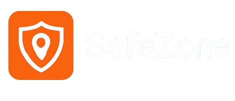

# 🌍 SafeZone - Sistema Integrado de Monitoramento de Desastres Naturais



## 🧩 Descrição

O **SafeZone** é um sistema completo desenvolvido para monitoramento, alerta e suporte a comunidades vulneráveis a **eventos climáticos extremos**, como enchentes, deslizamentos, secas e incêndios florestais. A aplicação centraliza diversas funcionalidades críticas em uma única plataforma web com foco em **usabilidade**, **escalabilidade**, **segurança** e **impacto social**.

---

## 👨‍💻 Integrantes do Grupo

- **Luiz Alecsander Viana** – RM553034
- **Guilherme Augusto de Oliveira** – RM554176
- **Lucas Martinez Lopes** – RM553816

---

## ⚙️ Tecnologias Utilizadas

| Camada         | Tecnologias                                |
|----------------|---------------------------------------------|
| **Back-End**   | Java 17, Spring Boot, Spring Security, Thymeleaf |
| **Front-End**  | HTML, CSS, Thymeleaf, Bootstrap (customizado) |
| **Banco**      | MongoDB (Spring Data MongoDB)              |
| **Outros**     | OAuth2 (Login com Google), RabbitMQ (Mensageria), AI (Spring AI), Docker, Render |

---

## 🚀 Como Rodar o Projeto Localmente

### 🔧 Pré-Requisitos

- Java 17+
- Maven 3.8+
- MongoDB em execução local (`mongodb://localhost:27017`)
- IDE (IntelliJ recomendada)

### 📦 Instalação

```bash
git clone https://github.com/luizalec7/safezone-web.git
cd safezone-web
```

### 🛠️ Build e Execução

```bash
./mvnw clean install
./mvnw spring-boot:run
```

> Acesse no navegador: [http://localhost:8080/login](http://localhost:8080/login)

---

## 🔐 Autenticação

- Login com **email e senha** (registrado via `/register`)
- **Login com Google OAuth2** (já configurado via Spring Security)

---

## 🧠 Funcionalidades

| Tela / Rota          | Funcionalidade                                                                 |
|----------------------|-------------------------------------------------------------------------------|
| `/login`             | Login tradicional e via Google OAuth2                                         |
| `/register`          | Cadastro de novos usuários                                                    |
| `/home`              | Menu principal com navegação para todos os módulos                            |
| `/alerts`            | Cadastro e visualização de alertas de risco                                   |
| `/areas-seguras`     | Cadastro de zonas seguras e exibição por bairro                               |
| `/campanhas`         | Exibição de campanhas e seus detalhes                                          |
| `/chat`              | Chat com IA (via Spring AI) para dúvidas comuns                               |
| `/usuario/perfil`    | Edição de email, senha e foto de perfil personalizada                         |
| `/reports`           | Envio de relatórios de ocorrências (alerta, zona segura ou campanha)          |
| `/report-list`       | (Admin) Visualização de todos os relatórios cadastrados                       |

---

## 📁 Estrutura de Pastas

```
src
├── main
│   ├── java
│   │   └── com.safezone.web
│   │       ├── controller
│   │       ├── model
│   │       ├── repository
│   │       ├── service
│   │       └── config
│   ├── resources
│   │   ├── static
│   │   │   ├── css
│   │   │   ├── image
│   │   │   └── uploads
│   │   └── templates
│   │       ├── login.html
│   │       ├── home.html
│   │       ├── alerts.html
│   │       ├── campanhas.html
│   │       ├── chat.html
│   │       ├── map.html
│   │       ├── reports.html
│   │       └── profile.html
```

---

## 📦 Banco de Dados - MongoDB

- Cada entidade do sistema é persistida como documento JSON:
    - `Usuario`
    - `Alerta`
    - `AreaSegura`
    - `Dúvidas`
    - `CampanhaSolidaria`
    - `Report`

---

## 🧪 Testes

- Testes manuais realizados em todas as funcionalidades
- Testes básicos via Swagger para endpoints REST (disponível se habilitado)

---

## ☁️ Implantação na Nuvem

- O projeto pode ser facilmente implantado usando:
    - Docker + Render (Web)
    - MongoDB Atlas
    - Azure 

---

## 📜 Licença

Este projeto é de uso acadêmico e não possui fins comerciais.
